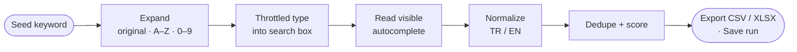
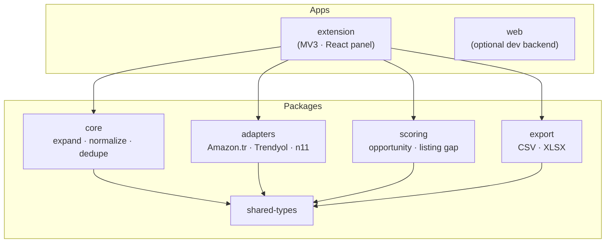

<div align="center">


# Keyword Radar

**Discover what Turkish marketplace shoppers actually type.**

A privacy-first **Manifest V3 Chrome extension** that collects user-initiated
autocomplete suggestions from **Amazon.com.tr**, **Trendyol**, and **n11** — then
normalizes, scores, and exports them so sellers can write listings around real demand.

[](https://github.com/aydogandagidir/keyword-radar/actions/workflows/ci.yml)


</div>

---

> ### 🇹🇷 Özet
> **Keyword Radar**, Türk pazaryeri satıcıları için bir Chrome eklentisidir. Amazon.com.tr,
> Trendyol ve n11 arama kutusuna bir tohum kelime yazdığınızda çıkan **otomatik tamamlama
> önerilerini** toplar; Türkçe/İngilizce normalize eder, tekilleştirir, fırsat skoru verir
> ve **CSV/XLSX** olarak dışa aktarır. Hesap bağlamaz, özel satıcı verisi okumaz — yalnızca
> ekranda zaten görünen önerileri işler ve her şeyi tarayıcıda yerel saklar.

## Table of contents

- [Why Keyword Radar?](#why-keyword-radar)
- [Features](#features)
- [Supported marketplaces](#supported-marketplaces)
- [How it works](#how-it-works)
- [Quick start](#quick-start)
- [Usage](#usage)
- [Architecture](#architecture)
- [Development](#development)
- [Privacy &amp; permissions](#privacy--permissions)
- [Roadmap](#roadmap)
- [Tech stack](#tech-stack)
- [Contributing](#contributing)
- [License](#license)

## Why Keyword Radar?

Marketplace search boxes already know what buyers want — every autocomplete dropdown is a
ranked list of real, high-intent queries. Keyword Radar turns that ambient signal into a
structured keyword set you can act on:

- **Find demand, not guesses.** Expand one seed keyword into dozens of probes and capture
  every suggestion each marketplace surfaces.
- **Built for Turkish.** Normalization is Turkish-aware (`ç ğ ı ö ş ü`), so variants collapse
  correctly instead of fragmenting your data.
- **Listing-ready output.** Score keywords by opportunity, compare coverage across
  marketplaces, and spot gaps between your title/description and what shoppers search.
- **Privacy by design.** No login, no scraping of private seller data, no background crawling
  — only the suggestions a shopper would already see, processed locally.

## Features

- 🔎 **Seed expansion** — original, suffix `A–Z`, prefix `A–Z`, and suffix `0–9` probe modes.
- 🛰️ **Visible-only collection** — reads the live autocomplete dropdown; never hidden endpoints.
- 🇹🇷 **Turkish/English normalization** — consistent deduping across diacritics and casing.
- 📊 **Opportunity scoring** — frequency, long-tail, marketplace coverage, and confidence
  rolled into a single 0–100 score.
- 🧩 **Listing gap analysis** — compare collected keywords against your title and description.
- 🗂️ **Marketplace coverage** — see which keywords appear on which marketplaces.
- 📤 **Export** — one-click **CSV** and multi-sheet **XLSX** (summary, keywords, analysis, gaps).
- 💾 **Saved runs** — keep collection sessions in local extension storage, per marketplace.
- ⚙️ **Speed profiles** — Fast / Balanced / Reliable throttling to stay gentle on each site.
- 🪟 **Floating panel** — draggable, resizable, collapsible; isolated in a Shadow DOM.

## Supported marketplaces

| Marketplace | Domain | Status |
| --- | --- | --- |
| Amazon Türkiye | `amazon.com.tr` | ✅ Shipping (first release scope) |
| Trendyol | `trendyol.com` | ✅ Shipping (first release scope) |
| n11 | `n11.com` | ✅ Shipping (first release scope) |
| Hepsiburada | `hepsiburada.com` | 🧪 In codebase, gated until autocomplete is reliable |
| Global (Amazon, eBay, Etsy, AliExpress, …) | — | 🧪 Generic adapters, not in the CWS manifest yet |

> The published Chrome Web Store package is intentionally narrow: only the three Turkish
> marketplaces above are requested in `host_permissions`. A build-time check
> (`scripts/package-extension.ps1`) and a unit test (`tests/manifest.test.ts`) fail the
> release if anything outside that scope leaks into the manifest.

## How it works



1. You enter a seed keyword in the floating panel on a supported marketplace.
2. The seed is expanded into many probe queries.
3. Each probe is typed into the search box on a throttle, and the **visible** suggestion list
   is read from the DOM (adapters fail closed — an empty list never crashes the page).
4. Suggestions are normalized, deduped (tracking best position + occurrence count), and scored.
5. Results render live and can be exported or saved locally.

## Quick start

**Prerequisites:** [Node.js](https://nodejs.org/) 20+ and [pnpm](https://pnpm.io/) 9+.

```bash
# 1. Install dependencies
pnpm install

# 2. Build everything (packages + extension)
pnpm build

# 3. (Optional) run the test suite
pnpm test
```

**Load the extension in Chrome:**

1. Run `pnpm --filter @bluedev/extension build`.
2. Open `chrome://extensions`.
3. Enable **Developer mode** (top-right).
4. Click **Load unpacked** and select `apps/extension/dist`.
5. Open Amazon.com.tr, Trendyol, or n11 and click the toolbar icon to toggle the panel.

**Package for the Chrome Web Store** (Windows / PowerShell):

```bash
pnpm package:extension
# → release/bluedev-marketplace-keyword-radar-cws-0.1.0.zip
```

## Usage

1. Navigate to a supported marketplace search page.
2. Click the **Keyword Radar** toolbar icon to open the floating panel.
3. Type a **seed keyword** (e.g. `telefon kılıfı`).
4. Pick **expansion modes** and a **speed profile**.
5. Press **Collect** and watch suggestions stream in with live opportunity scores.
6. Explore the **Words**, **Coverage**, **Actions**, and **Listing Gap** tabs.
7. **Copy**, export **CSV/XLSX**, or **Save run** for later.

## Architecture

A pnpm monorepo with a thin extension shell over reusable, well-tested packages.



| Package | Responsibility |
| --- | --- |
| `@bluedev/shared-types` | Shared TypeScript contracts (marketplaces, runs, scores, adapter interface). |
| `@bluedev/core` | Keyword expansion, Turkish-aware normalization, dedupe, frequency, coverage, throttling. |
| `@bluedev/adapters` | Per-marketplace search-input detection and visible-suggestion extraction, with a scored generic fallback for selector drift. |
| `@bluedev/scoring` | Opportunity scoring and listing-gap analysis (AI-ready interfaces, deterministic MVP). |
| `@bluedev/export` | CSV and multi-sheet XLSX generation (ExcelJS). |
| `apps/extension` | Manifest V3 extension: service worker, content script, Shadow-DOM React panel. |
| `apps/web` | Optional, developer-only Next.js dashboard + Zod-validated API (not shipped to users). |

<details>
<summary><strong>Project layout</strong></summary>

```
keyword-radar/
├─ apps/
│  ├─ extension/        # MV3 Chrome extension (Vite)
│  └─ web/              # optional dev-only Next.js backend
├─ packages/
│  ├─ shared-types/  core/  adapters/  scoring/  export/  config/
├─ docs/               # product spec, architecture, privacy, release checklist
├─ scripts/            # generate-icons.mjs, package-extension.ps1
├─ tests/              # vitest unit tests + Playwright e2e
└─ .github/workflows/  # CI (typecheck · lint · test · build)
```

</details>

## Development

| Command | What it does |
| --- | --- |
| `pnpm dev:extension` | Vite dev build for the extension. |
| `pnpm dev:web` | Run the optional Next.js dashboard. |
| `pnpm build` | Build all packages and apps. |
| `pnpm test` | Run the Vitest unit suite. |
| `pnpm test:e2e` | Build the extension and run Playwright smoke tests. |
| `pnpm typecheck` | Strict TypeScript checks across the workspace. |
| `pnpm lint` / `pnpm format` | ESLint (flat config) / Prettier. |
| `pnpm icons` | Regenerate extension PNG icons from `icon.svg`. |
| `pnpm package:extension` | Build + produce the Chrome Web Store zip. |

Continuous integration runs `typecheck → lint → test → build` on every push and pull request.

## Privacy &amp; permissions

Keyword Radar is built to request as little as possible:

- **Permissions:** only `activeTab` and `storage`.
- **Host permissions:** limited to `amazon.com.tr`, `trendyol.com`, and `n11.com`.
- **No** account connection, credentials, orders, customer, or payment data.
- **No** background crawling — collection only runs when you click **Collect**.
- It processes **only the visible autocomplete text** a shopper would already see.
- Saved runs and form state live in **Chrome local storage** on your machine.

See [`docs/11-privacy.md`](docs/11-privacy.md) and [`docs/10-permissions.md`](docs/10-permissions.md).

## Roadmap

- [x] Core engine: expansion, Turkish normalization, dedupe, scoring
- [x] Amazon.com.tr · Trendyol · n11 adapters
- [x] CSV / XLSX export, saved runs, listing-gap analysis
- [x] Extension icons, ESLint/Prettier, CI pipeline
- [ ] Chrome Web Store listing assets &amp; submission
- [ ] Expanded end-to-end test coverage
- [ ] Hepsiburada &amp; global marketplace adapters
- [ ] AI keyword clustering &amp; listing suggestions (interfaces already in place)

## Tech stack

**TypeScript** · **React 18** · **Vite** · **Next.js** (optional) · **ExcelJS** · **Zod** ·
**Vitest** · **Playwright** · **pnpm** workspaces · **Manifest V3**.

## Contributing

Contributions are welcome. Please:

1. Open an issue describing the change (templates in [`issue-templates/`](issue-templates/)).
2. Keep `pnpm typecheck`, `pnpm lint`, and `pnpm test` green.
3. Follow the [Definition of Done](docs/04-definition-of-done.md) and the privacy boundary above.

## License

No open-source license has been chosen yet — see [`LICENSE_NOTES.md`](LICENSE_NOTES.md).
Until one is selected, all rights are reserved by the author. Marketplace terms and Chrome
Web Store policies should be reviewed before any commercial launch.

---

<div align="center">
<sub>Built for Turkish marketplace sellers · powered by the search boxes they already use.</sub>
</div>
