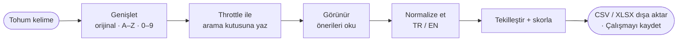
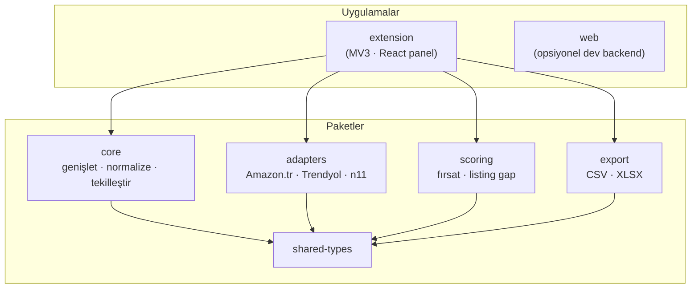

<div align="center">


# Keyword Radar

**Türk pazaryeri alıcılarının gerçekte ne aradığını keşfedin.**

Amazon.com.tr, Trendyol, Hepsiburada ve n11 arama kutularındaki kullanıcı tetiklemeli **otomatik tamamlama
önerilerini** toplayan, gizlilik-öncelikli bir **Manifest V3 Chrome eklentisi** — sonra bunları
normalize eder, skorlar ve dışa aktarır; böylece satıcılar listelerini **gerçek talebe** göre yazar.

**🇹🇷 Türkçe** · [English](README.en.md)

[](https://github.com/aydogandagidir/keyword-radar/actions/workflows/ci.yml)


</div>

---

## Neden Keyword Radar?

Pazaryeri arama kutuları, alıcıların ne istediğini zaten biliyor — her otomatik tamamlama
listesi, gerçek ve yüksek-niyetli sorguların sıralı bir listesidir. Keyword Radar bu hazır
sinyali, üzerinde aksiyon alabileceğiniz yapısal bir keyword setine dönüştürür:

- **Tahmin değil, talep bulun.** Tek bir tohum kelimeyi onlarca probe'a genişletin ve her
  pazaryerinin sunduğu tüm önerileri yakalayın.
- **Türkçe için tasarlandı.** Normalizasyon Türkçe-duyarlıdır (`ç ğ ı ö ş ü`); varyantlar
  bölünmek yerine doğru şekilde birleşir.
- **Listeye hazır çıktı.** Keyword'leri fırsat skoruna göre sıralayın, pazaryerleri arası
  kapsamı karşılaştırın ve başlık/açıklamanızla aramalar arasındaki boşlukları görün.
- **Tasarımı gereği gizli.** Giriş yok, özel satıcı verisi kazıma yok, arka planda tarama yok —
  yalnızca alıcının zaten gördüğü öneriler, cihazınızda yerel işlenir.

## Özellikler

- 🔎 **Tohum genişletme** — orijinal, sonek `A–Z`, önek `A–Z` ve sonek `0–9` probe modları.
- 🛰️ **Yalnızca-görünür toplama** — canlı otomatik tamamlama listesini okur; gizli uç nokta yok.
- 🇹🇷 **Türkçe/İngilizce normalizasyon** — aksan ve büyük/küçük harf farkı gözetmeden tutarlı tekilleştirme.
- 📊 **Fırsat skoru** — frekans, uzun-kuyruk, pazaryeri kapsamı ve güven tek bir 0–100 skorunda.
- 🧩 **Listing gap analizi** — toplanan keyword'leri başlığınız ve açıklamanızla karşılaştırın.
- 🗂️ **Pazaryeri kapsamı** — hangi keyword'ün hangi pazaryerinde göründüğünü görün.
- 📤 **Dışa aktarma** — tek tıkla **CSV** ve çok-sayfalı **XLSX** (özet, keyword, analiz, gap).
- 💾 **Kayıtlı çalışmalar** — toplama oturumlarını pazaryeri bazında yerel depoda tutun.
- ⚙️ **Hız profilleri** — her siteye nazik olmak için Fast / Balanced / Reliable throttle.
- 🪟 **Yüzen panel** — sürüklenebilir, yeniden boyutlandırılabilir, daraltılabilir; Shadow DOM'da izole.

## Desteklenen pazaryerleri

| Pazaryeri | Alan adı | Durum |
| --- | --- | --- |
| Amazon Türkiye | `amazon.com.tr` | ✅ Yayında (ilk sürüm kapsamı) |
| Trendyol | `trendyol.com` | ✅ Yayında (ilk sürüm kapsamı) |
| n11 | `n11.com` | ✅ Yayında (ilk sürüm kapsamı) |
| Hepsiburada | `hepsiburada.com` | ✅ Yayında (ilk sürüm kapsamı) |
| Global (Amazon, eBay, Etsy, AliExpress, …) | — | 🧪 Genel adaptörler, henüz CWS manifestinde değil |

> Yayınlanan Chrome Web Store paketi bilerek dardır: `host_permissions`'ta yalnızca yukarıdaki dört
> Türk pazaryeri istenir. Bir build-time kontrol (`scripts/package-extension.ps1`) ve bir birim
> test (`tests/manifest.test.ts`), bu kapsamın dışında bir şey manifeste sızarsa sürümü
> başarısız kılar.

## Nasıl çalışır?



1. Desteklenen bir pazaryerinde yüzen panele bir tohum kelime girersiniz.
2. Tohum, çok sayıda probe sorgusuna genişletilir.
3. Her probe, throttle ile arama kutusuna yazılır ve **görünür** öneri listesi DOM'dan okunur
   (adaptörler "fail-closed" çalışır — boş liste sayfayı asla çökertmez).
4. Öneriler normalize edilir, tekilleştirilir (en iyi konum + tekrar sayısı izlenir) ve skorlanır.
5. Sonuçlar canlı görünür; dışa aktarılabilir veya yerel kaydedilebilir.

## Hızlı başlangıç

**Önkoşullar:** [Node.js](https://nodejs.org/) 20+ ve [pnpm](https://pnpm.io/) 9+.

```bash
pnpm install      # bağımlılıkları kur
pnpm build        # paketleri + eklentiyi derle
pnpm test         # (opsiyonel) test paketini çalıştır
```

**Eklentiyi Chrome'a yükleme:**

1. `pnpm --filter @bluedev/extension build` çalıştırın.
2. `chrome://extensions` adresini açın.
3. **Geliştirici modu**nu açın (sağ üst).
4. **Paketlenmemiş öğe yükle**'ye tıklayın ve `apps/extension/dist` klasörünü seçin.
5. Amazon.com.tr, Trendyol, Hepsiburada veya n11'i açın ve paneli açıp kapatmak için araç çubuğu ikonuna tıklayın.

**Chrome Web Store için paketleme** (Windows / PowerShell):

```bash
pnpm package:extension
# → release/bluedev-marketplace-keyword-radar-cws-0.1.0.zip
```

## Kullanım

1. Desteklenen bir pazaryeri arama sayfasına gidin.
2. Yüzen paneli açmak için **Keyword Radar** araç çubuğu ikonuna tıklayın.
3. Bir **tohum kelime** yazın (örn. `telefon kılıfı`).
4. **Genişletme modlarını** ve bir **hız profilini** seçin.
5. **Topla**'ya basın ve önerilerin canlı fırsat skorlarıyla akışını izleyin.
6. **Kelimeler**, **Kapsam**, **Aksiyonlar** ve **Listing Gap** sekmelerini inceleyin.
7. **Kopyala**, **CSV/XLSX** dışa aktar veya sonrası için **Çalışmayı kaydet**.

## Mimari

Yeniden kullanılabilir, iyi test edilmiş paketler üzerine ince bir eklenti kabuğu olan bir pnpm monorepo.



| Paket | Sorumluluk |
| --- | --- |
| `@bluedev/shared-types` | Paylaşılan TypeScript sözleşmeleri (pazaryerleri, çalışmalar, skorlar, adaptör arayüzü). |
| `@bluedev/core` | Keyword genişletme, Türkçe-duyarlı normalizasyon, tekilleştirme, frekans, kapsam, throttle. |
| `@bluedev/adapters` | Pazaryeri bazlı arama-girişi tespiti ve görünür-öneri çıkarımı; seçici sürüklenmesine karşı skorlu genel fallback. |
| `@bluedev/scoring` | Fırsat skoru ve listing-gap analizi (AI-hazır arayüzler, deterministik MVP). |
| `@bluedev/export` | CSV ve çok-sayfalı XLSX üretimi (ExcelJS). |
| `apps/extension` | Manifest V3 eklentisi: service worker, content script, Shadow-DOM React panel. |
| `apps/web` | Opsiyonel, yalnızca-geliştirici Next.js panosu + Zod-doğrulamalı API (kullanıcıya sunulmaz). |

## Geliştirme

| Komut | Ne yapar |
| --- | --- |
| `pnpm dev:extension` | Eklenti için Vite dev build. |
| `pnpm dev:web` | Opsiyonel Next.js panosunu çalıştırır. |
| `pnpm build` | Tüm paketleri ve uygulamaları derler. |
| `pnpm test` | Vitest birim paketini çalıştırır. |
| `pnpm test:e2e` | Eklentiyi derler ve Playwright smoke testlerini çalıştırır. |
| `pnpm typecheck` | Workspace genelinde strict TypeScript kontrolü. |
| `pnpm lint` / `pnpm format` | ESLint (flat config) / Prettier. |
| `pnpm icons` | `icon.svg`'den eklenti PNG ikonlarını yeniden üretir. |
| `pnpm package:extension` | Build + Chrome Web Store zip'i üretir. |

Sürekli entegrasyon (CI) her push ve pull request'te `build → typecheck → lint → test` çalıştırır.

## Gizlilik & izinler

- **İzinler:** yalnızca `activeTab` ve `storage`.
- **Host izinleri:** yalnızca `amazon.com.tr`, `trendyol.com`, `hepsiburada.com` ve `n11.com`.
- **Hiçbir** harici HTTP isteği yok — sunucu, analitik veya telemetri yok.
- **Hiçbir** hesap bağlantısı, kimlik bilgisi, sipariş, müşteri veya ödeme verisi yok.
- **Hiçbir** arka plan taraması yok — toplama yalnızca **Topla**'ya bastığınızda çalışır.
- Yalnızca alıcının **zaten gördüğü görünür otomatik tamamlama metnini** işler.

Bkz. [`PRIVACY.md`](PRIVACY.md) ve [`docs/10-permissions.md`](docs/10-permissions.md).

## Yol haritası

- [x] Çekirdek motor: genişletme, Türkçe normalizasyon, tekilleştirme, skorlama
- [x] Amazon.com.tr · Trendyol · Hepsiburada · n11 adaptörleri
- [x] CSV / XLSX dışa aktarma, kayıtlı çalışmalar, listing-gap analizi
- [x] Eklenti ikonları, ESLint/Prettier, CI hattı, CWS-publish MCP
- [ ] Chrome Web Store listeleme varlıkları & gönderim
- [ ] `_locales` ile tam iki dilli (TR/EN) arayüz
- [ ] Global pazaryeri adaptörleri (Amazon global, eBay, Etsy, AliExpress)
- [ ] AI keyword kümeleme & listing önerileri (arayüzler hazır)

## Teknoloji yığını

**TypeScript** · **React 18** · **Vite** · **Next.js** (opsiyonel) · **ExcelJS** · **Zod** ·
**Vitest** · **Playwright** · **pnpm** workspaces · **Manifest V3**.

## Katkı

Bu özel (proprietary) bir projedir, ancak issue ve öneriler memnuniyetle karşılanır
([şablonlar](issue-templates/)). Kod katkısı yaparsanız `pnpm typecheck`, `pnpm lint` ve
`pnpm test`'i yeşil tutun ve yukarıdaki gizlilik sınırına uyun.

## Lisans

**Özel (Proprietary).** © 2026 Bluedev — tüm hakları saklıdır. Bkz. [`LICENSE`](LICENSE) (iki
dilli EN/TR). Amazon, Trendyol, Hepsiburada veya n11 ile ilişkili değildir; markalar ilgili sahiplerine
aittir. Ticari lisanslama veya ortaklık için: **bluedev.dev**.

---

<div align="center">
<sub>Türk pazaryeri satıcıları için · onların zaten kullandığı arama kutularından güç alır.</sub>
</div>
